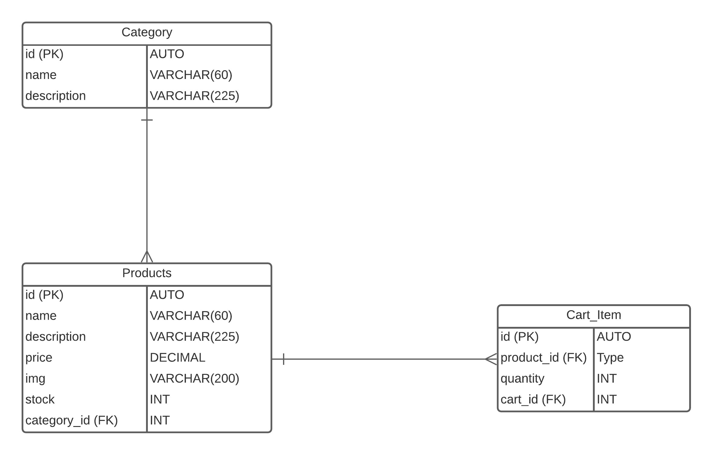
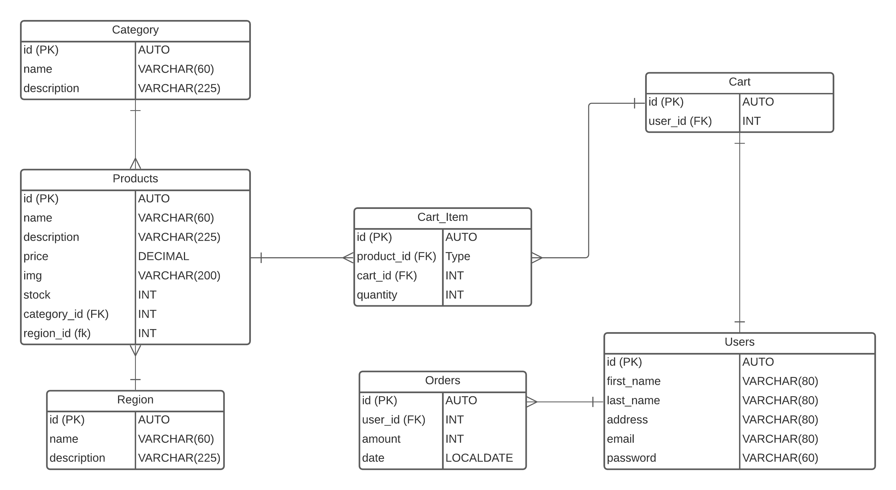
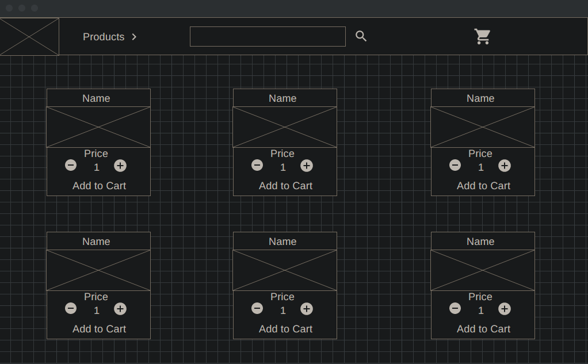

# Product Description
Online store to sell spices to customers. Available products will be shown to customers. Customers can add products to shopping cart and checkout. Authentication for login and registration. 
Orders are stored in database with user and date.

# User Stories
- [x] As a user, I should be able to navigate to a list of products available
  * Navigation to list of products is available in a navigation bar
- [ ] As a user, I should be able to search for a product
  * Search bar on top of page
  * Placeholder text of search
  * Placeholder text disappears when typing 
  * Search begins when search button is clicked
- [x] As a user, I should be able to find products by filtering through categories
  * List of categories for products available in navigation bar as a dropdown
  * User clicks category to navigate to list of products with that category
- [x] As a user, I want to add a product to my shopping cart
  * User clicks add to cart button located alongside the product
  * Product is added to user's cart
- [x] As a user, I want to navigate to my current shopping cart 
  * User clicks cart to navigate to their current cart
- [ ] As a user, I should be able to checkout and complete my purchase
- [x] As a user, I should see my current total in the shopping cart
  * Cart total is calculated by multiply quantity by price
  * Adds each product total to overall total
- [ ] As a user, I should be able to navigate back to the homepage
  * User clicks on home to navigate to home page 
- [ ] As a user, I want to view the product individually
  * User clicks on a product
  * User is navigated to individual page with more information about the product

# Initial ERD

# ERD

# Endpoints:

## Product
|Request Type|URL|Body|Header|Description|Access|
|---|---|---|---|---|---|
|POST|/api/products/|name, description, price, image, stock, category|none|creates new product|Public|
|GET|/api/products/|none|none|get all products|Public|
|GET|/api/products/{productId}/|none|none|get product by id|Public|
|PUT|/api/products/{productId}/|name, description, price, image, stock, category|none|update specified product by id|Public|
|DELETE|/api/products/{productId}/|none|none|delete specified product by id|Public|

## Category
|Request Type|URL|Body|Header|Description|Access|
|---|---|---|---|---|---|
|POST|/api/categories/|name, description|none|creates new category|Public|
|GET|/api/categories/|none|none|get all categories|Public|
|GET|/api/categories/{categoryId}/|none|none|get category by id|Public|
|PUT|/api/categories/{categoryId}/|name, description, price, image, stock, category|none|update specified category by id|Public|
|DELETE|/api/categories/{categoryId}/|none|none|delete specified category by id|Public|
|GET|/api/categories/{categoryName}/products/|none|none|get products by category name|Public|

## Cart Item
|Request Type|URL|Body|Header|Description|Access|
|---|---|---|---|---|---|
|POST|/api/cart-item/|quantity, product|none|creates new cart item|Public|
|GET|/api/cart-item//|none|none|get all cart items|Public|
|GET|/api/cart-item//{cartItemId}/|none|none|get cart item by Id|Public|
|PUT|/api/cart-item//{cartItemId}/|quantity, product|none|update specified cart item by id|Public|
|DELETE|/api/cart-item//{cartItemId}/|none|none|delete specified cart item by id|Public|

# Product Page Wireframe

# Tools
## Front-end

Angular 

Angular Material

## Back-end

Spring Boot 

Postgres 

# Challenges 
The biggest challenge was working with Angular. How to use and resuse components is very complex. As well as being able to effciently pass data between the components. It will take some time to learn how to manage how the components will fit into place in the app.

# Future
For the future i want to be able to add authorization and authentication for added users, so their can be unique carts for every user. Roles will allow certain users to manipulate the database through the API. Also their should be more feedback for events so users can know if something was successful

# Frontend Repo
https://github.com/dthomason224/Spice_Shop_Frontend
# Backend Repo
https://github.com/dthomason224/Spice_Shop_API
